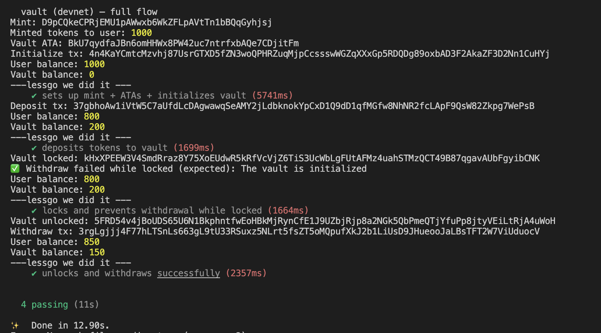

# 🔐 Vault Locker (Solana Devnet)

## ✅ Overview
This project demonstrates a complete on-chain vault system using Anchor on Solana Devnet — covering:
- Vault initialization  
- Token deposit  
- Lock and unlock flow  
- Withdraw tokens after unlock  

---

## ⚙️ Setup

```bash
# Clone repo
git clone <repo-url>
cd vault-locker

# Install dependencies
npm install

# Build program
anchor build

# Deploy to Devnet
anchor deploy
````

---

## 🌐 Environment Setup

```bash
export ANCHOR_PROVIDER_URL=https://api.devnet.solana.com
export ANCHOR_WALLET=~/.config/solana/id.json
```

Ensure your wallet has SOL:

```bash
solana airdrop 2
```

---

## 🧪 Run Tests on Devnet

```bash
anchor test --skip-local-validator
```

---

## 📸 Test Output (Devnet Flow)



| Step              | Description                                                                                                                                                                                                                          | Tx / Address |
| ----------------- | ------------------------------------------------------------------------------------------------------------------------------------------------------------------------------------------------------------------------------------ | ------------ |
| **Mint**          | `D9pCQkeCPRjEMU1pAWwxb6WkZFLpAVtTn1bBQqGyhjsj`                                                                                                                                                                                       |              |
| **Vault ATA**     | `BkU7qydfaJBn6omHHWx8PW42uc7ntrfxbAQe7CDjitFm`                                                                                                                                                                                       |              |
| **Initialize TX** | [`4n4KaYCmtcMzvhj87UsrGTXD5fZN3woQPHRZuqMjpCcssswWGZqXXxGp5RDQDg89oxbAD3F2AkaZF3D2Nn1CuHYj`](https://explorer.solana.com/tx/4n4KaYCmtcMzvhj87UsrGTXD5fZN3woQPHRZuqMjpCcssswWGZqXXxGp5RDQDg89oxbAD3F2AkaZF3D2Nn1CuHYj?cluster=devnet) |              |
| **Deposit TX**    | [`37gbhoAw1iVtW5C7aUfdLcDAgwawqSeAMY2jLdbknokYpCxD1Q9dD1qfMGfw8NhNR2fcLApF9QsW82Zkpg7WePsB`](https://explorer.solana.com/tx/37gbhoAw1iVtW5C7aUfdLcDAgwawqSeAMY2jLdbknokYpCxD1Q9dD1qfMGfw8NhNR2fcLApF9QsW82Zkpg7WePsB?cluster=devnet) |              |
| **Lock TX**       | `kHxXPEEW3V4SmdRraz8Y75XoEUdwR5kRfVcVjZ6TiS3UcWbLgFUtAFMz4uahSTMzQCT49B87qgavAUbFgyibCNK`                                                                                                                                            |              |
| **Unlock TX**     | `5FRD54v4jBoUDS65U6N1BkphntfwEoHBkMjRynCfE1J9UZbjRjp8a2NGk5QbPmeQTjYfuPp8jtyVEiLtRjA4uWoH`                                                                                                                                           |              |
| **Withdraw TX**   | [`3rgLgjjj4F77hLTSnLs663gL9tU33RSuxz5NLrt5fsZT5oMQpufXkJ2b1LiUsD9JHueooJaLBsTFT2W7ViUduocV`](https://explorer.solana.com/tx/3rgLgjjj4F77hLTSnLs663gL9tU33RSuxz5NLrt5fsZT5oMQpufXkJ2b1LiUsD9JHueooJaLBsTFT2W7ViUduocV?cluster=devnet) |              |

---

## ✅ Final Test Summary

```
Vault (Devnet) — full flow
✓ Initialize Vault
✓ Deposit Tokens
✓ Lock & Prevent Withdrawal
✓ Unlock & Withdraw Tokens

All tests passing ✔️
```

---

## 📂 Project Structure

```
vault-locker/
 ├── programs/
 │   └── vault/
 │       ├── src/
 │       │   ├── lib.rs
 │       │   └── states.rs
 ├── tests/
 │   └── vault-locker.ts
 ├── Anchor.toml
 ├── Cargo.toml
 └── README.md
```

---

## 🧭 Commands Recap

```bash
# Build program
anchor build

# Deploy to devnet
anchor deploy

# Run tests
anchor test --skip-local-validator
```

